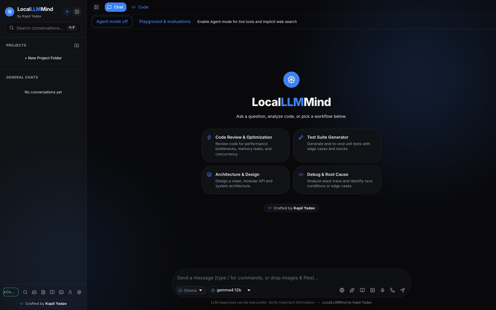
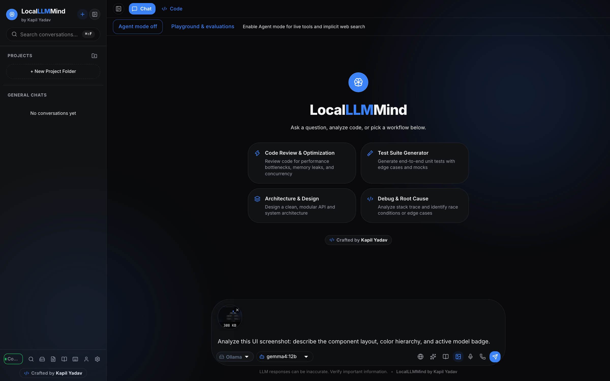
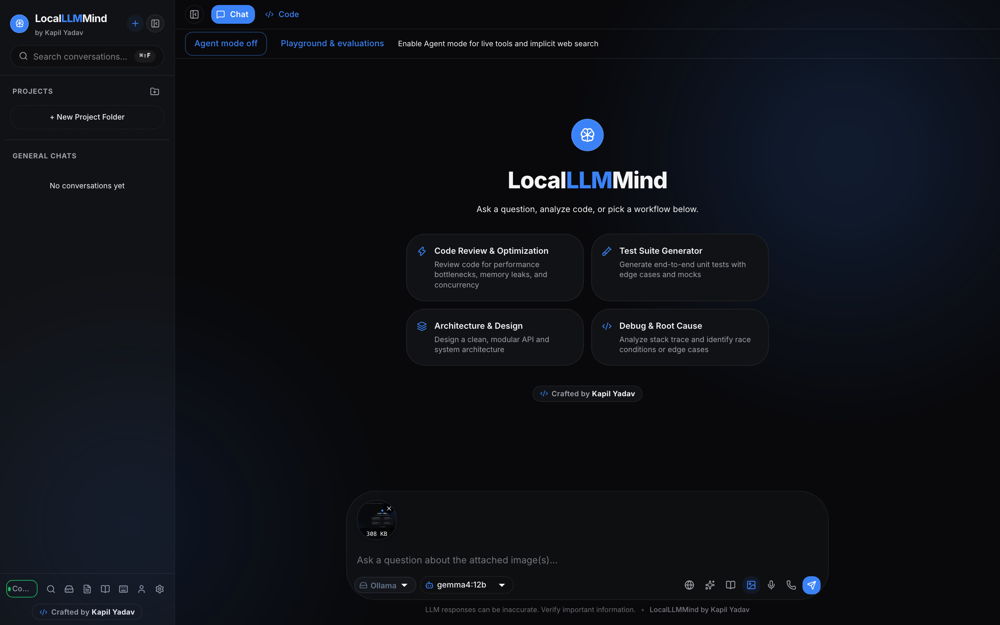
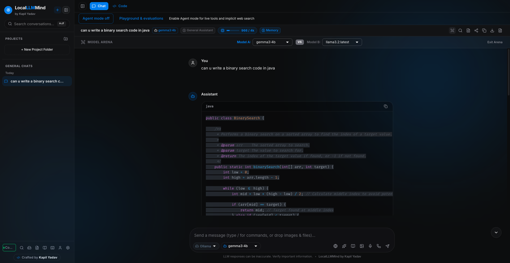
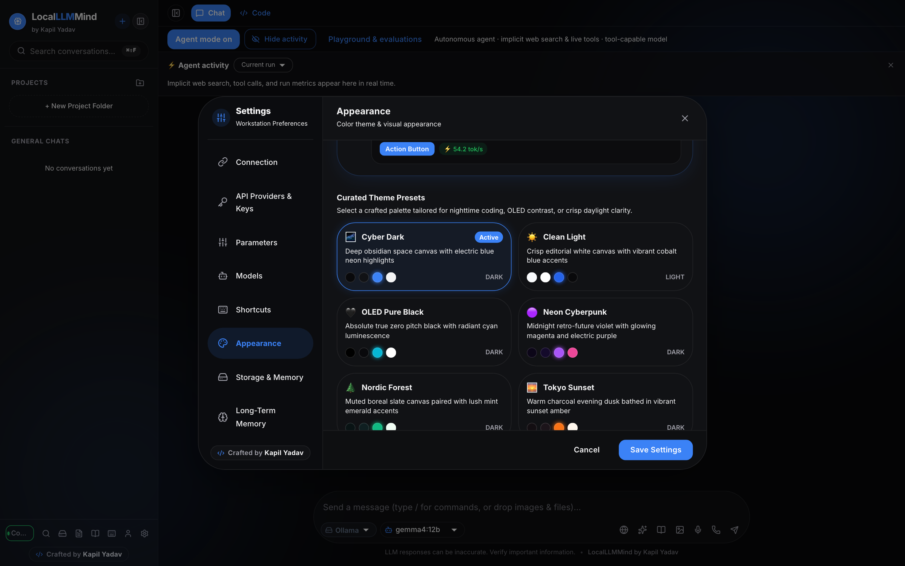
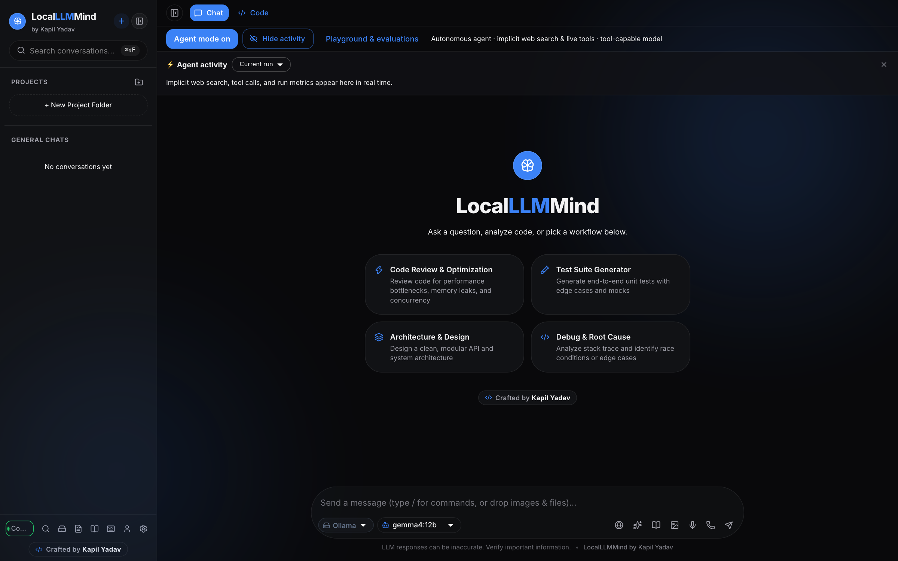
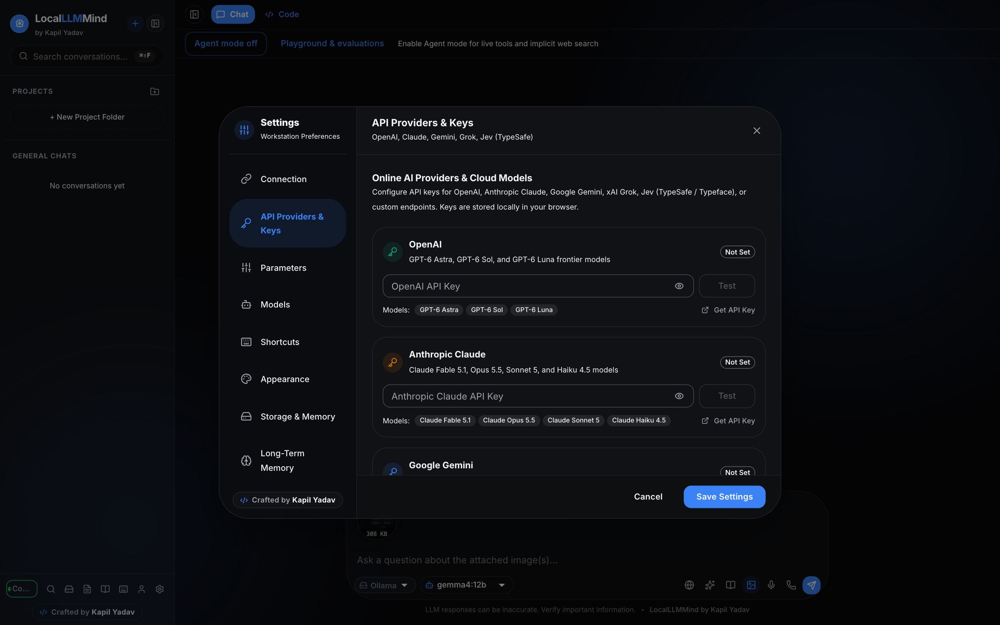
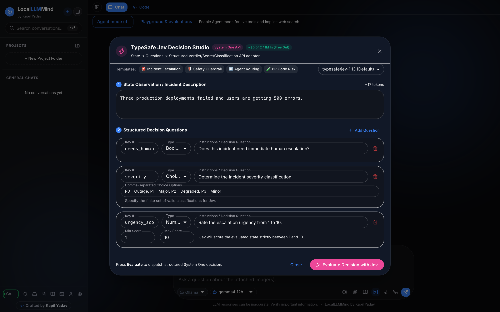
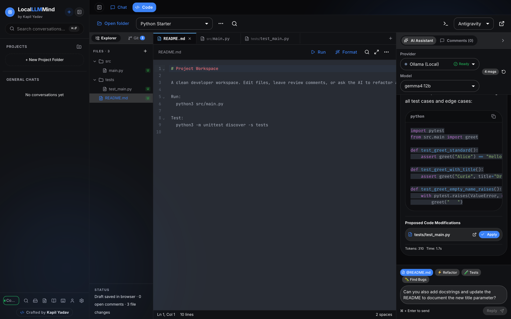

# LocalLLMMind

<div align="center">

**A production-grade, privacy-first desktop AI workstation for local LLMs.**  
*Engineered by **Kapil Kumar Yadav***

[](https://react.dev/)
[](https://vitejs.dev/)
[](https://mui.com/)
[](https://ollama.com/)
[](https://hub.docker.com/r/kapilyadav22/localllmmind)
[](#-progressive-web-app)
[](https://github.com/sponsors/kapilyadav22)
[](LICENSE)

</div>

<p align="center">
  
</p>

---

## 🌟 Overview

**LocalLLMMind** is a full-featured desktop AI workstation that interfaces directly with **Ollama** to run LLMs 100% locally. Zero data leaves your machine. It combines the polish of modern AI products with hardware-optimized streaming, live benchmarking, reasoning model introspection, multimodal vision, RAG document chat, and a complete model management toolkit.

---

## ✨ Features

### 👁️ Multimodal Vision Support
<p align="center">
  
</p>

- **Paste, drag-and-drop, or browse** images directly into the chat composer.
- Automatic Base64 conversion to Ollama's `/api/chat` `images` array.
- Click-to-zoom lightbox for high-resolution image inspection.
- Supports `llama3.2-vision`, `llava`, `moondream`, and all Ollama vision models.

### ⚡ Hardware-Optimized Streaming (30–80+ tok/s)
- Tokens are buffered on a 35ms micro-interval (~30fps), reducing React re-renders by ~75%.
- Jitter-free auto-scroll during active generation.
- Live generation metrics badge: speed (`⚡ 54.2 tok/s`), token count, duration, and active model.

### 🧠 DeepSeek-R1 & Reasoning Model Support
- Built-in `<think>...</think>` tag parser for DeepSeek-R1, Qwen 2.5, and reasoning models.
- Interactive collapsible thought accordion with live pulsing indicator during chain-of-thought.

### 📄 RAG / Document Chat ("Chat with Docs")
<p align="center">
  
</p>

- Drag-and-drop or browse **40+ file formats**: source code (`.py`, `.js`, `.ts`, `.rs`, `.go`, `.java`, `.cpp`), configs (`.json`, `.yaml`, `.toml`, `.env`), data (`.csv`, `.sql`), and docs (`.md`, `.txt`).
- Client-side text extraction and vector chunking sandbox — nothing leaves your machine.
- 500KB safety guard to prevent context window overflows.

### 📥 In-App Model Manager
- View installed models with disk size, parameter count, quantization format, and model family.
- Pull new models with real-time progress bars and cancel support.
- 1-click quick-pull chips for popular models (`llama3.2`, `deepseek-r1:8b`, `phi4`, `gemma3`).

### ✏️ Message Edit & Regenerate
- **Edit any user message** — truncates the conversation and streams a fresh response from that point.
- **Regenerate assistant responses** with full version history.
- **Version navigation** — browse between regenerated responses with `◀ 2/3 ▶` arrows.

### 🎭 AI Personas
- 6 built-in system personas: General Assistant, Software Architect, Bug Hunter, Concise & Direct, Academic Researcher, Creative Writer.
- Switch personas per-conversation from the chat header.

### ⚔️ Arena Mode (Side-by-Side Comparison)
<p align="center">
  
</p>

- Run two models simultaneously on the same prompt.
- Compare responses side-by-side with live generation speeds (`tok/s`) and vote for the better output.

### 📝 Prompt Library & Slash Commands
- Built-in prompt template library with CRUD, categories, and import/export.
- Type `/` in the composer for instant slash-command autocomplete.

### 🔍 Global Conversation Search (<kbd>Cmd+Shift+F</kbd>)
- Full-text search across all conversations with highlighted match snippets.
- Results grouped by conversation with 1-click jump to the exact message.

### 🧠 Smart Auto-Title Generation
- After the first exchange, the LLM automatically generates a descriptive 3–5 word title for the conversation.

### 📁 Project Folders
- Create color-coded project folders to organize conversations.
- Collapsible sidebar tree with chat count badges.
- Move conversations between projects.

### 🎙️ Voice Input & Text-to-Speech
- Speak prompts using Web Speech Recognition with live interim feedback.
- Listen to assistant responses with markdown-sanitized TTS output.

### 📊 Context Window Meter
- Live header chip showing estimated tokens vs. context limit (e.g. `~1.2k / 4k tok`).
- Color-coded thresholds: blue → amber (65%+) → red (85%+).

### 💾 Local Storage & Disk Sync
- Choose between browser memory or a local directory on your hard drive.
- Auto-sync conversations to disk as JSON + readable Markdown files (Obsidian-compatible).
- Full JSON backup import/export with data portability.

### 📤 Share & Export
- Export as **PNG image**, **Markdown**, **plain text**, or **PDF** (print-optimized A4).
- Native OS Web Share API integration.

### 🌐 Web Search Grounding
- Ground LLM responses with real-time web search context.
- Source citations displayed as clickable chips on messages.

### 🧪 Artifact Sandbox
- Interactive sandbox drawer for rendering HTML/CSS/JS artifacts generated by the LLM.

### ⌨️ Custom Keyboard Shortcuts
- Full shortcuts manager with conflict detection and custom keybinding creation.
- Bind custom key combos to prompt templates and quick actions.

| Shortcut | Action |
| :--- | :--- |
| <kbd>Cmd+K</kbd> | New Conversation |
| <kbd>Cmd+B</kbd> | Toggle Sidebar |
| <kbd>Cmd+F</kbd> | Find in Chat |
| <kbd>Cmd+Shift+F</kbd> | Global Search |
| <kbd>Cmd+Shift+M</kbd> | Model Manager |
| <kbd>Cmd+,</kbd> | Settings |
| <kbd>Cmd+/</kbd> | Shortcuts Manager |
| <kbd>Escape</kbd> | Stop Generation / Dismiss |

### 📱 Progressive Web App
- Installable as a standalone desktop app via Chrome/Edge.
- Offline caching service worker for app shell and static assets.

### 🎨 Custom UI Themes & Appearance Editor
<p align="center">
  
</p>

- **8 Curated Designer Presets**: Modern Dark, Clean Light, Midnight Obsidian, Cyberpunk Neon, Tokyo Night, Forest Emerald, Sunset Glow, and Royal Amethyst.
- **Custom Accent Color Swatches**: Pick from curated neon/pastel accents or custom hex values with instant live preview.
- **Message Bubble Roundness**: Granular slider from sharp (4px) to pill (24px) bubble shapes.
- **Typography Scale Adjuster**: Adjust font scaling (Small, Medium, Large, Extra Large) across all chat and workspace interfaces.
- **Persistent Preferences**: Theme configuration syncs across restarts via local storage.

### ⚡ Autonomous Agent Mode & Implicit Live Tools
<p align="center">
  
</p>

- **Implicit Live Web Search**: The agent queries DuckDuckGo for live facts, current documentation, and news without requiring manual approval clicks, citing sources directly.
- **Real-Time Weather Integration**: Live weather conditions and forecasts via Open-Meteo.
- **Interactive Agent Activity Log**: View step-by-step tool traces, execution times, token counts, and export trace JSONs.
- **Collapsible Activity Feed**: Quick "Hide activity" / "Show activity" toggle with persistent visibility preference.
- **Human-in-the-Loop Safe Execution**: Destructive actions (modifying files and executing shell commands) require explicit approval.

### 🌐 Multi-Provider AI Support (Local & Cloud)
<p align="center">
  
</p>

- **First-Class Ollama Integration**: 100% private, native local execution.
- **Top Cloud Providers**: Seamlessly toggle between OpenAI, Anthropic Claude, Google Gemini, and xAI Grok.
- **TypeSafe Jev Integration**: Native adapter for deterministic and structured LLM decision workflows.
- **Custom Endpoints**: Connect any OpenAI-compatible API gateway with custom base URLs and headers.

### 📐 TypeSafe Jev Decision Studio
<p align="center">
  
</p>

- **Deterministic Evaluation Workflows**: Model selection, structured state parameters, and decision criteria matrix.
- **Strict Output Validation**: Ensure schema compliance and structured JSON guarantees.
- **Live Test Suite**: Execute multi-attribute scoring and benchmark decision matrices before production deployment.

### 🌓 Dark & Light Theme
- Curated glassmorphism design with fluid gradients and subtle micro-animations.
- Fully responsive — works on desktop, tablet, and mobile.

---

## 🚀 Quickstart

### Prerequisites
1. Install [Node.js](https://nodejs.org/) (v18+).
2. Install and run [Ollama](https://ollama.com/):
   ```bash
   ollama serve
   ```
3. Pull a model:
   ```bash
   ollama pull llama3.2
   # For vision:
   ollama pull llama3.2-vision:11b
   ```

### Installation

```bash
git clone https://github.com/kapilyadav22/local_llm_ui.git
cd local_llm_ui
npm install
npm run dev
```

Open [http://localhost:2210/](http://localhost:2210/) in your browser.

### Production Build

```bash
npm run build
npm run preview
```

---

## 🐳 Docker Deployment

### ⚡ Quick Start via Docker Hub (No build required)

Pull and run the pre-built, lightweight Alpine image directly from Docker Hub:

```bash
docker run -d \
  --name localllmmind \
  -p 3000:80 \
  --add-host=host.docker.internal:host-gateway \
  -e OLLAMA_URL=http://host.docker.internal:11434 \
  --restart unless-stopped \
  kapilyadav22/localllmmind:latest
```

Open **[http://localhost:3000](http://localhost:3000)** in your browser.

> 📦 **Docker Hub Repositories:**  
> - [`kapilyadav22/localllmmind`](https://hub.docker.com/r/kapilyadav22/localllmmind) *(Official)*  
> - [`kapilyadav22/runlocalllm`](https://hub.docker.com/r/kapilyadav22/runlocalllm) *(Mirror)*

---

### Docker Compose (Recommended)

```bash
# Start LocalLLMMind → http://localhost:3000
docker compose up -d
```

> Automatically connects to host Ollama at `http://host.docker.internal:11434`.

#### All-in-One (LocalLLMMind + Ollama containerized):

```bash
docker compose --profile with-ollama up -d
```

---

### Build from Source

```bash
docker build -t localllmmind .
docker run -d \
  -p 3000:80 \
  --add-host=host.docker.internal:host-gateway \
  -e OLLAMA_URL=http://host.docker.internal:11434 \
  --name localllmmind \
  localllmmind
```

| Variable | Default | Description |
|---|---|---|
| `PORT` | `80` | Nginx listening port inside container |
| `OLLAMA_URL` | `http://host.docker.internal:11434` | Ollama API endpoint on host gateway |

---

## 🏗️ Project Structure

```text
localllmmind/
├── src/
│   ├── components/
│   │   ├── Chat/           # ChatView, MessageBubble, MessageInput, WelcomeScreen,
│   │   │                   # ArenaMessageBubble, ContextMeter, PersonaDialog,
│   │   │                   # PromptLibraryDialog, ShareChatDialog, ArtifactSandboxDrawer
│   │   ├── Layout/         # AppLayout, Sidebar, GlobalSearchDialog, ProjectDialog
│   │   ├── Settings/       # SettingsDialog, ModelManagerDialog
│   │   └── common/         # MarkdownRenderer, ShortcutsManager, AppLogo, ModelSelector
│   ├── constants/          # App branding, models, personas, shortcuts
│   ├── hooks/              # useAudio (Speech-to-Text & TTS)
│   ├── services/           # ollamaService, webSearchService
│   ├── store/              # React Context + useReducer state management
│   ├── utils/              # Storage, documentUtils, pdfExport, dialogService
│   ├── theme.js            # MUI Dark & Light theme tokens
│   └── main.jsx            # Entrypoint with PWA service worker registration
├── public/                 # PWA manifest, service worker, icons
├── Dockerfile              # Multi-stage Node + Nginx Alpine build
├── docker-compose.yml      # Production orchestration with Ollama profiles
├── nginx.conf.template     # Streaming reverse proxy for LLM tokens
└── vite.config.js          # Vite config with Ollama API proxy
```


### Code workspace: opening projects and adding context

<p align="center">
  
</p>

- **Antigravity-Style Agent Chat**: Pinned bottom composer for continuous follow-ups, auto-scrolling tool streams, and 1-click file proposal application.
- **GitHub Sync & Gists**: Link your GitHub account via Personal Access Token. Push commits to existing or new repositories, or export code to Gists.
- **Project Import & Folders**: Connect local folders directly or import ZIP archives (preserves relative paths, auto-skips `node_modules` and binaries).
- **Persistent Terminal & Runner**: Full interactive terminal sessions with persistent state across reloads, command history, and background processes.
- **Code Formatting & Git**: Syntax-aware formatting (Prettier & Black), file staging, line review comments, and unified diff inspection.

### Agent workspace, model controls, and evaluations

- **Model Manager**: Inspect, warm, or unload active models in Ollama memory without deleting downloaded weights.
- **Autonomous Agent Mode**: Tool-calling agent with implicit web search, document retrieval, and collapsible step-by-step activity traces.
- **Code Agent Workspace**: Autonomous repository scanning, file diagnosis, refactoring, and code proposal generation.
- **Agent Traces & Activity**: Real-time duration metrics, token counters, and downloadable JSON execution traces.
- **Playground & Evaluations**: Custom prompt tuning, parameter presets, and automated fixture evaluations with assertion scoring.

---

### 🖼️ Real Feature Scenarios & High-Resolution Screenshots

| # | Scenario / Feature | Real Screenshot | Description |
| :---: | :--- | :---: | :--- |
| **1** | **Antigravity IDE Agent Chat** | [Inspect Preview](docs/assets/real_code_chat_antigravity.png) | Multi-turn developer agent chat with continuous auto-scrolling, code proposals, and sticky bottom prompt composer. |
| **2** | **GitHub Account Linking** | [Inspect Preview](docs/assets/real_github_link.png) | Git Source Control sidebar with GitHub PAT token connection, account badge, and remote repository sync options. |
| **3** | **Push Project to GitHub** | [Inspect Preview](docs/assets/real_github_push.png) | Connected GitHub account profile with 1-click Push to remote repository, branch target, and commit authoring. |
| **4** | **Multimodal Vision** | [Inspect Preview](docs/assets/real_vision_multimodal.png) | Upload images with real-time thumbnail preview, size badge, and visual layout/color analysis prompt. |
| **5** | **Code Studio Refactor** | [Inspect Preview](docs/assets/real_code_refactor.png) | Full project file explorer with Python/JS syntax highlighting and AI Assistant refactoring prompt. |
| **6** | **Local RAG & Knowledge Base** | [Inspect Preview](docs/assets/real_rag_demo.png) | Local RAG document dialog showing chunking statistics, token counts, and semantic retrieval sandbox. |
| **7** | **Extensive Code Review & Comments** | [Inspect Preview](docs/assets/real_code_comments_extensive.png) | Multi-tab code workspace with file tree, editor, and dedicated line-targeted review comments panel. |
| **8** | **AI Providers Configuration** | [Inspect Preview](docs/assets/real_ai_providers.png) | Unified provider settings: OpenAI, Anthropic Claude, Google Gemini, xAI Grok, Jev, Ollama, and Custom endpoints. |
| **9** | **TypeSafe Jev Decision Studio** | [Inspect Preview](docs/assets/real_jev_studio.png) | Deterministic decision studio modal with model selector, state schema editor, and evaluation criteria matrix. |
| **10** | **Model Comparison & Arena** | [Inspect Preview](docs/assets/real_model_comparison_results.png) | Side-by-side responses (Llama 3.2 vs DeepSeek-R1) with live `tok/s` benchmarks, token counts, and voting chips. |
| **11** | **Chat Dashboard** | [Inspect Preview](docs/assets/real_chat_dashboard.png) | Full workstation home showing sidebar, project folders, model selector, context meter, and quick prompts. |
| **12** | **Autonomous Agent Mode (Active)** | [Inspect Preview](docs/assets/real_agent_mode_active.png) | Step-by-step tool trace, live implicit DuckDuckGo search execution, and collapsible activity panel. |
| **13** | **Autonomous Agent Mode (Clean)** | [Inspect Preview](docs/assets/real_agent_mode_hidden.png) | Streamlined view with activity collapsed for distraction-free reading of grounded agent answers. |
| **14** | **Theme Customizer & Swatches** | [Inspect Preview](docs/assets/real_theme_customizer.png) | 8 curated theme presets, custom accent color swatches, bubble roundness slider, and font scale tuner. |
| **15** | **Evaluations & Benchmark Lab** | [Inspect Preview](docs/assets/real_evaluations_lab.png) | System prompt tuning, fixture test runs, pass/fail assertion metrics, and model latency comparisons. |


---

## 👨‍💻 Author

**Kapil Kumar Yadav** — *Senior Software Engineer*

- [](https://github.com/kapilyadav22)
- [](https://www.linkedin.com/in/kapilyadav22/)
- [](https://x.com/kapilyadav2210)
- [](mailto:singhkapil347@gmail.com)

---

## 💖 Sponsor & Support

If you find **LocalLLMMind** valuable for your workflow, consider sponsoring or supporting this project:

- [💖 Sponsor on GitHub Sponsors](https://github.com/sponsors/kapilyadav22)
- ⭐ **Star this repository** to help others discover it
- 🐛 **Report bugs or submit features** to help improve the project

---

## 📄 License

Licensed under the [Apache License 2.0](LICENSE).

Copyright © 2026 Kapil Kumar Yadav. All rights reserved.
